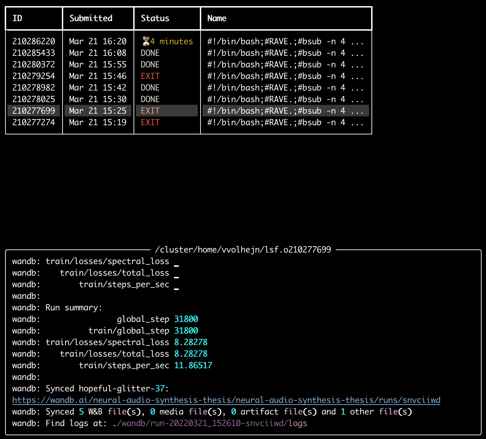

# gjobs
Job management for the LSF scheduling system.
Gives a real-time overview of both running and finished jobs and allows viewing their outputs.  



## Installation

```
git clone https://github.com/vvolhejn/gjobs.git
cd gjobs
pip install .
```

## Usage

Simply run `gjobs`.
Use the arrow keys to navigate the job list.
Press `L` to open a job's output in `less`.